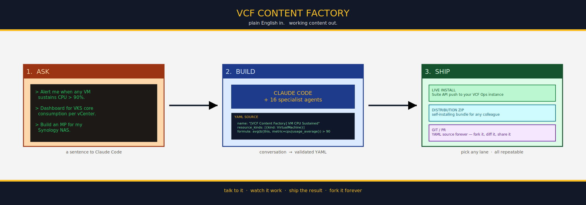

# VCF Content Factory

**Describe what you want VCF Operations to monitor. Get it.**

```
> "Monitor my Dell PowerEdge servers via Redfish."
> "Show me cluster CPU usage by VM, top 20."
> "Alert me when any datastore drops below 10% free and has been
>  trending that way for 6 hours."
> "Build a dashboard for storage capacity that my CFO can read."
```

You write sentences. The framework writes the YAML, validates it
against the live wire format, and installs it on your VCF Operations
instance. The content is version-controlled, portable across
instances, and survives uninstall — because every piece is plain text
in a git repo and every install is a visible CLI call. Nothing is
hidden.

This is what the workflow looks like in practice — you and Claude Code,
in conversation, producing content while you focus on the question
you're trying to answer.



*Three nodes. Talk to it, let the agents work, ship the result on the
lane you want. The full assembly-line view and the internal plumbing
are in [HOW_IT_WORKS.md](HOW_IT_WORKS.md).*

---

## Why I care

If you have a VCF Operations instance and you've ever:

- Tried to author a super metric and got tangled in a DSL with no LSP
  or error messages worth reading,
- Built a dashboard and watched it render a blank column for reasons
  the UI didn't explain,
- Wired together symptoms and alerts and recommendations and lost
  track of which name resolved to which UUID,
- Wrote a one-off custom group rule and then couldn't reproduce it on
  another instance because the IDs were different,
- Set up a third-party adapter that almost did what you wanted and
  wished you could just *describe the API* and have a management pack
  come out the other end —

…this is for you.

What you get:

- **You don't need to know the DSLs.** Describe the calculation; the
  framework writes the formula. Describe the alert outcome; the
  framework wires the symptom set. Describe the API; the framework
  proposes an object model.
- **You don't need to fight wire formats.** Super metric ID
  prefixing, dashboard folder placement, view column namespacing,
  describe.xml chaining quirks — all hidden behind YAML that
  validates before it ships.
- **Your content travels.** Every artifact is YAML with stable UUIDs
  baked in. The bundle you authored against dev installs cleanly on
  prod with every cross-reference intact.
- **Your content stays yours.** When the framework gets something
  wrong, the YAML is right there to hand-edit. No magic, no lock-in.
- **The framework learns.** Every hard-won correction you make
  becomes a rule the agents follow next time. Auto-memory is off by
  design — knowledge lives in the repo where it can be diffed,
  reviewed, and shared.

---

## What it can produce today

| Content type | Status |
|---|---|
| Super metrics | Yes — with rollups, `where` clauses, cross-metric refs |
| Dynamic custom groups | Yes — property + relationship rules |
| List views | Yes — built-in + super-metric columns; list/bar/pie/donut/trend |
| Dashboards | Yes — 10 widget types, ~94% coverage of typical instances |
| Symptoms | Yes — metric / property / event, static + dynamic thresholds |
| Alert definitions + recommendations | Yes — tiered severity, compound symptom sets |
| Reports | Yes — cover, TOC, view + dashboard sections |
| **Management packs (Tier 1 — REST adapters via MPB)** | Yes — author a YAML, get a `.pak` |
| **Management packs (Tier 2 — native Java SDK adapters)** | Phase 1 complete — framework + builder work, first real adapter in progress |
| Distribution bundles | Yes — `[VCF Content Factory] <Name>.zip` for any admin on any instance |

All content lands via the UUID-preserving content-import path where it
matters (super metrics, views, dashboards, reports), so cross-references
survive cross-instance installs without manual re-stitching.

---

## What it deliberately doesn't do

Honest about the boundaries:

- **It's not a GUI.** This is a CLI and a Claude Code conversation. If
  point-and-click is the requirement, look elsewhere.
- **It's not a generic "ask the AI" wrapper.** The framework will
  refuse to invent metric keys, API endpoints, or DSL functions. When
  it doesn't know something, it runs reconnaissance against your live
  instance or asks you.
- **It can't replace knowing your environment.** The framework
  produces *correct* content. Whether the content is *useful* is
  still your call.
- **Federated SSO sources (VIDB, VIDM) aren't supported for the
  install path.** Use a Local service account.
- **Some MPB Tier 1 patterns require Tier 2.** Per-instance attribute
  groups (e.g. one resource per server with `Hardware|Power:PS1|...`
  style addressing per PSU) need our native Java SDK pipeline — Tier
  1's compiler can't author that wire form. The framework will tell
  you which tier a given case needs.

---

## Try it

Two paths:

**I want to install something someone else built.** You received a
`[VCF Content Factory] <Name>.zip`. Extract it, run `python3
install.py` (or `.\install.ps1`), answer the prompts. Drop multiple
zips in one directory and the installer multi-selects across them.

**I want to author something new.** Open Claude Code in this repo,
have a conversation:

> "I want a super metric that sums provisioned vCPUs for all
>  powered-on VMs in each cluster, excluding vCLS VMs."

Then say yes to the install prompt and watch the content land.
[Getting_Started.md](Getting_Started.md) walks the first conversation
in detail with worked examples for each content type.

---

## Where to go next

- **[Getting_Started.md](Getting_Started.md)** — first conversation,
  example prompts for each content type, how to talk to the framework.
- **[HOW_IT_WORKS.md](HOW_IT_WORKS.md)** — the orchestrator + agents
  architecture, the codification loop, Tier 1 vs Tier 2, why it's set
  up this way. For people considering forking, extending, or just
  curious about the AI-agent design.
- **[docs/vcf_ops_concepts.md](docs/vcf_ops_concepts.md)** — reference
  walkthrough of every VCF Ops content type the framework produces:
  what they are, how they relate, how they're identified, where
  they're enabled.
- **[CLAUDE.md](CLAUDE.md)** — the rules the orchestrator follows.
- **[ROADMAP.md](ROADMAP.md)** — what's on deck.

---

## Where this came from

Built on Anthropic's [Claude Code](https://claude.com/claude-code) by
a VCF Operations field engineer fixing the same content-bundle papercuts
over and over until they decided to teach an AI to do it instead. The
framework's author maintains
[sentania-labs/AriaOperationsContent](https://github.com/sentania-labs/AriaOperationsContent)
as the proving ground; every design decision in this framework
(UUID stability, content-zip install, `[VCF Content Factory]`
naming, recon-before-author) comes from a real-world failure that
shipped to production once and isn't going to ship again.

## License

MIT. See [LICENSE](LICENSE).
