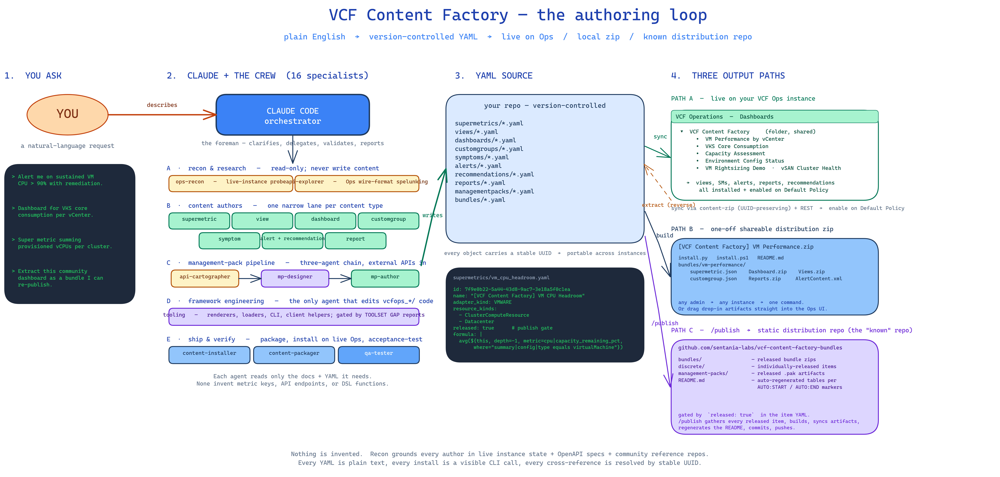
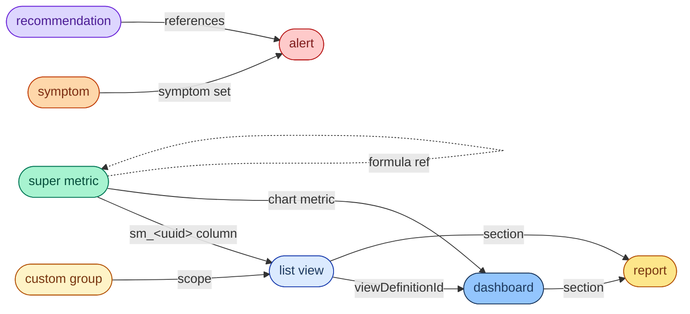

# VCF Content Factory

**I'm here to take your plain-text descriptions, PowerCLI scripts, or
napkin sketches and turn them into real VCF Operations content.**

Super metrics, list views, dashboards, custom groups, symptoms, alert
definitions, reports, and their remediation recommendations — you
describe what you want in English, I write the YAML, validate it,
install it on your VCF Operations instance, and enable it in policy.
You stay focused on the question you're trying to answer; I handle
the DSL quirks, the undocumented wire formats, and the "why does
this render as a blank column" landmines.

Authored content ships two ways: **live via the authoring loop** (describe
it, I install it on your instance), or **as a distribution package**
(`[VCF Content Factory] <name>.zip`) with a self-contained Python +
PowerShell installer that any admin can run on any VCF Ops instance
without touching the framework.

## What this is

A framework for authoring and installing VCF Operations content as
version-controlled YAML, driven by an agentic loop built around
Claude Code. You describe a need; a roster of specialized subagents
does the recon, authoring, and installation work, grounded in the
VCF Operations documentation and a library of reference content from
the community.

The value is not "one super metric." The value is:

- **You don't need to know the DSL.** Describe the filter, the
  aggregation, the rollup levels — I figure out the formula.
- **You don't need to hand-build dashboards.** Describe the report
  shape, I wire the view and dashboard together.
- **You don't need to hunt through undocumented wire formats.** The
  framework knows the quirks — correct `where` clause syntax,
  super-metric-column namespace prefixes, dashboard folder placement,
  `resourceKindId` stable prefixes — and applies them automatically.
- **Your content is version-controlled and portable.** Every super
  metric, view, and dashboard has a stable UUID stored in YAML, so
  the same bundle installs cleanly on dev, test, and prod instances
  with every cross-reference intact.
- **Nothing is hidden.** Every YAML is plain text. Every install is
  a visible CLI call. Every piece of recon leaves a trail. If you
  want to take over from the framework and hand-edit the output, it's
  all there.

## What this is not

- A UI. This is a CLI and an authoring loop.
- A replacement for understanding VCF Operations. You still need to
  know what you want to measure and roughly where it lives.
- A generic "ask the AI" wrapper. The framework refuses to fabricate
  metric keys, API endpoints, or DSL functions. When it doesn't know
  something, it runs reconnaissance against the live instance or
  asks you.

## How it works



You describe what you want. A Claude Code **orchestrator** hands the
work to a crew of **sixteen specialized subagents** organized into
five clusters:

- **Recon & research** — `ops-recon` probes your live instance,
  `api-explorer` reverse-engineers Ops wire formats. Read-only;
  never writes content.
- **Content authors** — one narrow lane per content type:
  `supermetric`, `view`, `dashboard`, `customgroup`, `symptom`,
  `alert` (+ recommendation), `report`.
- **Management-pack pipeline** — a chained trio:
  `api-cartographer` maps the target external API,
  `mp-designer` interviews and produces the MP design,
  `mp-author` writes the YAML.
- **Framework engineering** — `tooling` is the only agent that
  edits the `vcfops_*/` Python packages, and only when a content
  author returns a `TOOLSET GAP` report.
- **Ship & verify** — `content-installer` syncs and enables,
  `content-packager` builds distribution zips, `qa-tester` runs
  end-to-end install / uninstall acceptance cycles.

Each agent has hard rules it won't break — no inventing metric keys,
no fabricating API endpoints, no skipping validation. Recon always
runs first; authoring is strictly bottom-up so cross-references
resolve.

Output lands along **three paths**:

1. **Live on your Ops instance** via the UUID-preserving
   content-import path (so cross-references between SMs, views,
   dashboards, and reports survive cross-instance installs).
2. **One-off shareable distribution zip** — any admin, any instance,
   one command. Or drag the drop-in artifacts into the Ops UI by hand.
3. **Published to a static "known" distribution repo** — a two-step
   release lifecycle. `/release <type> <name>` materializes a release
   manifest under `releases/`, flips the source's `released:` flag,
   and commits both. `/publish` then gathers every released item,
   builds zips, routes each to a per-type subdirectory in
   [`sentania-labs/vcf-content-factory-bundles`](https://github.com/sentania-labs/vcf-content-factory-bundles)
   (`dashboards/`, `bundles/`, `views/`, `supermetrics/`, etc.),
   regenerates the README catalog between AUTO markers, commits, and
   pushes. That becomes the canonical place peers pull factory
   content from. See `designs/release-lifecycle-v1.md` for the full
   pipeline.

All of it is plain-text YAML in a git repo. Nothing is hidden.

## What I can produce today

| Content type | Status |
|---|---|
| Super metrics (with per-level rollups, `where` clauses, cross-metric references) | Yes |
| Dynamic custom groups (with property + relationship rules) | Yes |
| List views (with built-in metrics and super metric columns; list/bar/pie/donut/trend modes) | Yes |
| Dashboards (10 widget types, named folder placement, shared by default, self-provider pins) | Yes |
| Symptom definitions (metric/property/event conditions, static + dynamic thresholds) | Yes |
| Alert definitions (tiered severity, symptom sets, impact badges) | Yes |
| Report definitions (cover page, TOC, view + dashboard sections) | Yes |
| Remediation recommendations (reusable, alert-referenced) | Yes |
| Management packs (REST-API-sourced adapters, MPB-compiled `.pak`) | In progress — see note below |

**Dashboard widget types supported**: `ResourceList`, `View`,
`TextDisplay`, `Scoreboard`, `MetricChart`, `HealthChart`,
`ParetoAnalysis`, `Heatmap`, `AlertList`, `ProblemAlertsList`. This
covers ~94% of observed widget usage on a typical instance. The
scoping doc for the next renderer expansion (PropertyList +
ResourceRelationshipAdvanced + SparklineChart, targeting ~96%) lives
at `context/widget_renderer_scope.md`.

**Management pack status — known enough to be dangerous.** You can
author a REST-adapter MP as YAML, validate it, render the MPB design
JSON, and build a `.pak` end-to-end. One example MP in the tree
today: Synology NAS (`managementpacks/synology_nas.yaml`) with two
more designs in flight under `designs/` (UniFi, GitLab). **Install
currently hits a known boundary**: the MPB-compiled
`<adapter_kind>_adapter3.jar` has the adapter kind baked into its
package path and cannot be regenerated without the MPB server-side
build endpoint, which the framework does not yet drive. You can
author/render/build today; expect to hand-finish the JAR or wait
for the MPB-build wiring before `.pak` install completes cleanly.
The roadmap also carries a **VMware Operations SDK** MP path as
the longer-term complement for adapters MPB can't express — see
[ROADMAP.md](ROADMAP.md).

All content is installed via the Ops content-import path where
appropriate (super metrics, views, dashboards, reports) so UUIDs
are preserved — cross-references between super metrics, views,
dashboards, and reports survive cross-instance installs without
any manual re-stitching. Custom groups, symptoms, and alerts install
via the direct REST API because they're identified by name, not UUID.

### How the pieces reference each other

The framework authors compound requests **bottom-up** because content
types reference each other by name and those names resolve to UUIDs
at validate time. Super metrics have to exist before views can
reference them; views before dashboards; symptoms before alerts;
views and dashboards before reports.



Green nodes (super metric, list view, dashboard, report) install via
the **UUID-preserving content-zip path**. Warm nodes (custom group,
symptom, alert, recommendation) install via **direct REST** and are
identified by name.

### Demo bundles ready to install

Four first-party bundles ship in `bundles/` today, built with the
framework itself:

| Bundle | Contents | Built zip |
|---|---|---|
| `vm-performance` | 6 SMs + 1 view + 1 dashboard | `[VCF Content Factory] VM Performance.zip` |
| `vks-core-consumption` | 10 SMs + 1 view + 1 dashboard | `[VCF Content Factory] VKS Core Consumption.zip` |
| `capacity-assessment` | 11 SMs + 2 views + 1 dashboard + 1 custom group | `[VCF Content Factory] Capacity Assessment.zip` |
| `environment-config-status` | 4 SMs + 3 views + 1 dashboard | `[VCF Content Factory] Environment Config Status.zip` |

A third-party `idps-planner` bundle (under `bundles/third_party/`)
demonstrates the reverse flow — it was **extracted** from a community
dashboard rather than authored from scratch, and re-packaged as a
distributable zip.

## Getting started

There are two ways to use this: **as a content consumer** (install a
distribution package someone else built on your VCF Ops instance) or
**as a content author** (describe new content in the Claude Code
authoring loop).

### I just want to install a distribution package

You received (or downloaded) a file named like
`[VCF Content Factory] <Name>.zip` and you want to install what's
inside it.

1. Extract the zip anywhere. You'll see `install.py`, `install.ps1`,
   a `README.md`, and one or more `bundles/<slug>/` subdirectories.
2. **Python** (works on Linux / macOS / Windows):
   ```bash
   python3 install.py
   ```
   Or **PowerShell** (Windows / PS 5.1 or PS 7+):
   ```powershell
   .\install.ps1
   ```
3. Answer the prompts (host, username, password, auth source). The
   installer authenticates, imports all content types in dependency
   order, enables super metrics on the Default Policy, and verifies.
   Uninstall with `--uninstall` (Python) or `-Uninstall` (PowerShell);
   **uninstall requires the `admin` account** for dashboards/views/
   reports due to content-zip ownership semantics.
4. If you have multiple distribution packages, extract all of them
   into the same directory. The installer will show a multi-select
   checklist of every bundle it finds and install the ones you pick
   under a single credential prompt.

You can also drag individual files from inside `bundles/<slug>/`
directly into the VCF Ops UI import dialogs — the filenames
(`supermetric.json`, `Views.zip`, `Dashboard.zip`, `customgroup.json`,
`Reports.zip`, `AlertContent.xml`) match the conventions admins
recognize from community content packages.

### I want to author new content

1. Put your VCF Operations credentials in a `.env` file at the repo
   root (use `.env.example` as a template):

   ```bash
   # Three profiles: prod (read-only recon), qa (primary-lab admin),
   # devel (destructive playground).
   export VCFOPS_PROD_HOST=vcfops.example.com
   export VCFOPS_PROD_USER=svc-claude-poc
   export VCFOPS_PROD_PASSWORD='...'
   export VCFOPS_PROD_VERIFY_SSL=false

   export VCFOPS_QA_HOST=vcfops.example.com
   export VCFOPS_QA_USER=admin
   export VCFOPS_QA_PASSWORD='...'
   export VCFOPS_QA_VERIFY_SSL=false

   export VCFOPS_DEVEL_HOST=vcfops-devel.example.com
   export VCFOPS_DEVEL_USER=admin
   export VCFOPS_DEVEL_PASSWORD='...'
   export VCFOPS_DEVEL_VERIFY_SSL=false

   export VCFOPS_PROFILE=prod   # default active profile
   ```

   Select the active profile with `--profile <name>` on any CLI command,
   or set `VCFOPS_PROFILE` in your shell. Validate/list default to `prod`;
   sync/enable/delete default to `devel`.

2. Install Python dependencies:

   ```bash
   pip install -r requirements.txt
   ```

3. Populate the reference content clones (optional but highly
   recommended — it's what the framework checks before authoring to
   avoid reinventing community-authored patterns):

   ```bash
   ./scripts/bootstrap_references.sh
   ```

4. Tell the framework what you want. Open Claude Code in this
   directory and describe the content you need. Examples:

   > "I want a super metric that sums provisioned vCPUs for all
   > powered-on VMs in each cluster, excluding vCLS VMs."

   > "Give me a dashboard that shows VKS core consumption per
   > vCenter, mirroring this PowerCLI script: [paste]"

   > "Create a custom group for VMs on NFS datastores so I can
   > scope alerts to them."

   > "Alert me on sustained VM CPU utilization above 90%, with a
   > recommendation pointing operators at the usual root causes."

5. Approve the YAML the framework shows you. It installs + enables
   the content live on your instance. Everything lands in the
   `VCF Content Factory` folder in the Ops dashboards sidebar,
   prefixed `[VCF Content Factory]` for easy identification.

6. When the content is stable, **release and publish it** to the
   distribution repo for other admins to consume:

   ```
   # one or more times — flips released: true, materializes
   # releases/<slug>.yaml, commits both files:
   /release dashboard my_dashboard
   /release bundle my_curated_set --version 1.1
   /release view my_view --notes notes/release-1.0.md

   # then once — builds every released item, routes outputs by type
   # into vcf-content-factory-bundles/, regenerates the README,
   # commits, pushes:
   /publish
   ```

   `/release` accepts a content type (`dashboard`, `view`,
   `supermetric`, `customgroup`, `report`, `bundle`) plus a name.
   **Name resolution is strict**, in this order: filename stem
   (`my_dashboard`), exact display name (`"[VCF Content Factory] My
   Dashboard"`), or path (`dashboards/my_dashboard.yaml`). Spaces in
   the slug, typos, or partial matches do not resolve — the slug is
   the safest form because it's the literal filename stem with no
   quoting. The CLI errors loudly on unresolved names with the
   candidates it considered.

   `/publish` is the end of the lifecycle. It refuses to run if the
   factory or distribution repo has uncommitted changes, validates
   everything first, supports `--dry-run` to preview, and uses a
   lockfile in the dist repo to prevent concurrent runs.

   See `designs/release-lifecycle-v1.md` for the full pipeline,
   schema, and resolved design decisions.

## Where to go next

- **[ADMIN.md](ADMIN.md)** — detailed administrator guide. Read this
  before clicking around the GUI. It walks through every CLI
  command, the authoring workflow, how the subagents cooperate, and
  how to recover when something goes sideways.
- **[CLAUDE.md](CLAUDE.md)** — the framework's internal rules that
  the agents follow. Useful if you want to understand the guardrails
  or extend the framework yourself.
- **[context/](context/)** — topical background files the agents
  read on demand: the DSL reference, wire format notes, UUID
  contract, API surface map, reference-source allowlist. These are
  the authoritative answers the framework leans on when deciding
  what's possible.

## Where this came from

Built on top of Anthropic's [Claude Code](https://claude.com/claude-code)
with a roster of specialized subagents, each with a narrow
responsibility (reconnaissance, super metric authoring, dashboard
authoring, etc.). The agents cite VCF Operations' own documentation,
the OpenAPI specs, and an allowlisted library of reference content
from the community — nothing is invented from thin air.

The framework's author maintains
[sentania-labs/AriaOperationsContent](https://github.com/sentania-labs/AriaOperationsContent)
and uses it as the proving ground for new VCF Operations content
patterns; several of the design decisions in this framework (UUID
stability, content-zip install, `[VCF Content Factory]` naming
convention) come straight from real-world pain fixing broken bundles
in that repo.

## License

MIT. See [LICENSE](LICENSE).
